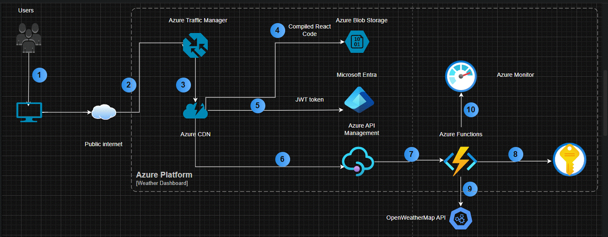
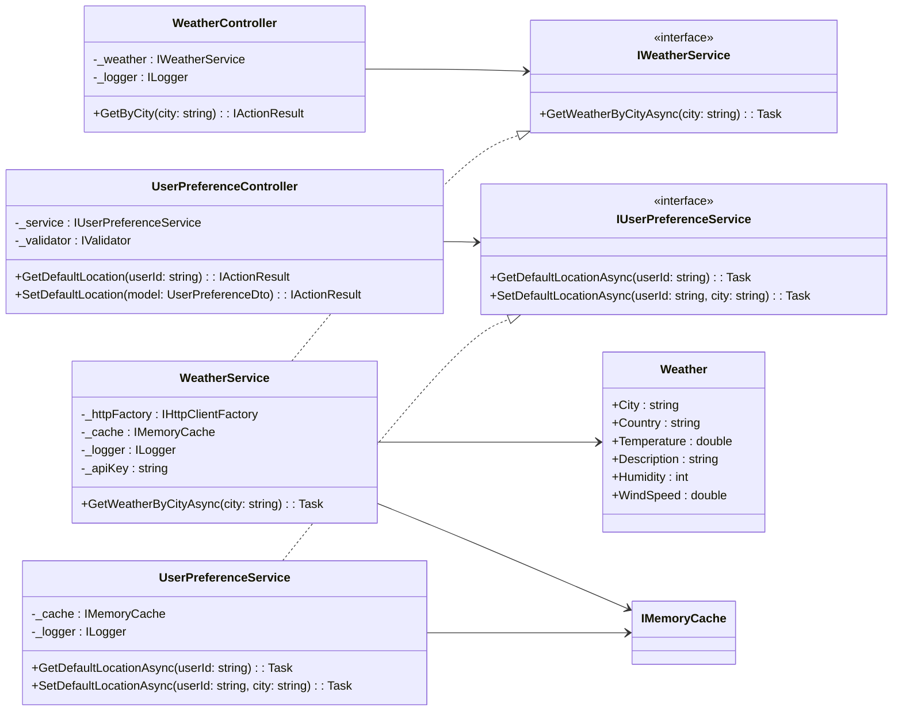

# Weather Dashboard API - Endpoint Documentation & Setup Guide

## Overview

This **Weather Dashboard API** provides current weather information for a given city using OpenWeatherMap as an external data source.  
It also supports user preference management through a dedicated API.

---

## Deployment Strategy



## Architectural Reflection

The **Weather API** project follows a **clean and modular architecture** built on **ASP.NET Core Web API**, emphasizing maintainability, testability, and scalability.

### 1. Layered Design

The solution adopts a **layered approach**, separating responsibilities across distinct components:

- **Controllers** – Handle HTTP communication and return standardized responses (`ProblemDetails` for errors).
- **Services** – Contain business logic (e.g., weather data retrieval, caching, retry policies).
- **Models** – Define domain entities and response structures.
- **Dependency Injection** – Centralized in `Program.cs`, promoting flexibility and testability.

This separation allows the system to evolve without impacting unrelated parts of the codebase.

---

### 2. Use of Modern ASP.NET Core Features

- **Dependency Injection** for `IWeatherService` and `IUserPreferenceService`  
- **FluentValidation** and **ProblemDetails** for clean validation and consistent API error handling  
- **Polly Retry Policy** for transient HTTP failures  
- **Memory Caching** for performance  
- **Logging** via the Serilog

---

### 3. Resilience and Observability

- Transient errors from external APIs are handled with **Polly** (exponential backoff).
- Logging captures detailed diagnostic information.
- Errors are standardized as **ProblemDetails** responses for easy client parsing.

---

### 4. Testing and Maintainability

- Unit tests cover both **controllers** and **services**.
- Common test setup is extracted into `Setup` methods for reusability.
- The architecture supports **CI/CD** integration and **mock-driven** testing.

---

### 5. Frontend Integration

- React frontend communicates with the API through `fetch` using `/services` hooks.
- Clear API endpoints and standardized JSON responses simplify integration.
- Both apps are decoupled but integrated seamlessly through a consistent REST contract.

---

### High-Level Integration Overview and UML diagram

## Component Integration

```mermaid
flowchart LR
    subgraph Frontend["React Frontend"]
        A1[SearchBar Component]
        A2[WeatherDisplay Component]
        A3[DefaultLocation Component]
        A4[useWeather Hook]
        A5[useUserPreferences Hook]
    end

    subgraph Backend["ASP.NET Core Web API"]
        B1[WeatherController]
        B2[UserPreferenceController]
        B3[WeatherService]
        B4[UserPreferenceService]
        B5[IMemoryCache]
        B6[Polly Retry Policy]
    end

    subgraph External["External APIs"]
        C1[(OpenWeatherMap API)]
    end

    A1 -->|fetchWeather()| B1
    A3 -->|setDefaultCity()| B2
    B1 -->|calls| B3
    B3 -->|retry + cache| B5
    B3 -->|fetch weather data| C1
    B2 -->|cache default city| B4
    B4 --> B5
```

---

## UML Class Diagram (ASP.NET Core Web API)



---

## Setup & Installation Guide (Web API)

### 1 Prerequisites

- [.NET 8 SDK](https://dotnet.microsoft.com/en-us/download)
- [Visual Studio 2022](https://visualstudio.microsoft.com/vs/) or VS Code
- OpenWeatherMap API key (get it from https://openweathermap.org/api)

---

### 2️ Clone the Repository

```bash
git clone https://github.com/vns-arvind/WeatherDashboardApi.git
cd WeatherDashboardApi
```

---

### 3️ Configure `appsettings.json`

Update the configuration file with your API BaseUrl:

```json
"OpenWeatherMapSettings": {
  "BaseUrl": "https://api.openweathermap.org/data/2.5/"
}
```
APIKey is stored in user profile. dotnet command is:

dotnet user-secrets init
dotnet user-secrets set "OpenWeatherMap:ApiKey" "your_real_api_key_here"

In WINDOWS, this secret key / value store at %APPDATA%\Microsoft\UserSecrets\

---

### 4️ Install Dependencies

```bash
dotnet restore
```

---

### 5️ Run the Application

```bash
dotnet run
```

The API will start on:  
 `https://localhost:5290`

---

### 6️ Swagger UI

After running the project, open:
```
https://localhost:5290/swagger
```
to explore and test endpoints.

---

##  Weather Endpoint

### **GET** `/api/weather?city={cityName}`

Retrieves current weather data for a specified city.

#### Parameters
| Name | Type | Required | Description |
|------|------|-----------|--------------|
| city | string | True | City name (e.g., London) |

#### Example Request
```bash
GET /api/weather?city=London
```

### Response
**200 OK**
```json
{
  "city": "London",
  "country": "GB",
  "temperatureCelsius": 15.0,
  "description": "Cloudy",
  "humidity": 80,
  "windSpeed": 4.2
}
```

**400 Bad Request**
```json
{
  "title": "Bad Request",
  "status": 400,
  "detail": "City parameter is required."
}
```

**502 Bad Gateway**
```json
{
  "title": "Weather provider failed",
  "status": 502,
  "detail": "Unable to retrieve weather data from external API."
}
```
---

##  User Preferences Endpoint

### **GET** `/api/user-preferences/{userId}`

Fetches user preferences such as default city .

#### Parameters
| Parameter | Type | Location | Required | Description |
|------------|------|-----------|-----------|-------------|
| `userId` | string | path | True | Unique ID of the user. |

#### Example Request
```bash
GET /api/user-preferences/varvinp
```

#### Response
**200 OK**
```json
{
  "userId": "varvinp",
  "defaultCity": "London"
}
```

**404 Not Found**
```json
{
  "title": "User not found",
  "status": 404
}
```

### **POST** `/api/user-preferences`

Creates or updates user preferences.

#### Example Request
```json
{
  "userId": "varvinp",
  "City": "London"
}
```

#### Response
**200 OK**
```json
{
  "message": "Default city updated successfully."
}
```

**400 Bad Request**
```json
{
  "title": "Invalid Request",
  "status": 400,
  "detail": "City cannot be empty."
}
```

## Error Handling
All errors follow the [RFC 7807 ProblemDetails](https://datatracker.ietf.org/doc/html/rfc7807) standard:
```json
{
  "title": "Invalid Request",
  "status": 400,
  "detail": "The city name must not be empty."
}
```

---

##  Unit Testing

To run tests:

```bash
dotnet test
```

The solution includes tests for:
- Controller logic (`WeatherControllerTests`, `UserPreferencesControllerTests`)
- Service logic (`WeatherServiceTests`, `UserPreferenceServiceTests`)

---

##  Note

- ASP.NET Core 8 Web API
- FluentValidation for input validation
- ProblemDetails for Error Handling
- Serilog for logging
- Polly for retry policies
- MemoryCache for performance optimization
- Swagger for API documentation

---

